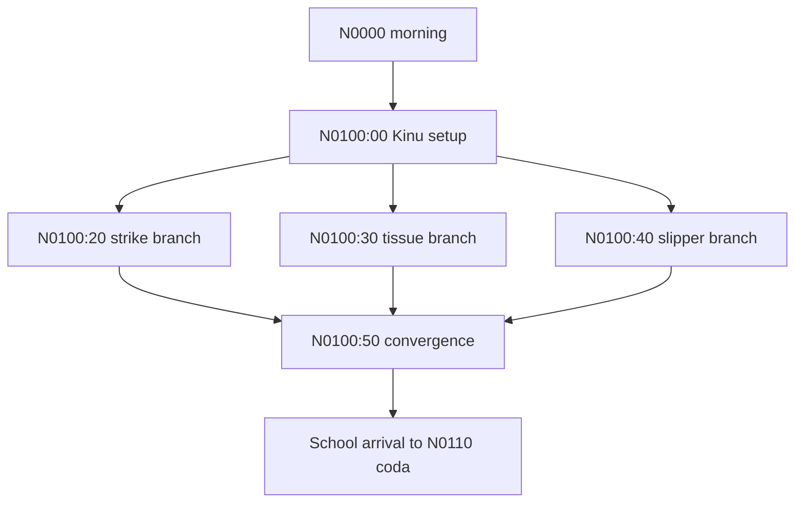

# Final lane-N continuity and policy preflight

Prepared: 2026-08-22 (Europe/Rome). The requested `20260821` record name is
retained.

Status: **LANE-N PREFLIGHT COMPLETE; 429/429 rows permitted and projected.**
There is no lane-N content-policy, narrative-gate, projection, or repository-
wide manifest blocker. The previously reported historical-overlay overlap was
resolved by the supervisor and the public gates were rerun successfully on
2026-08-22, as recorded below.

## Scope and classification

- Authoritative inputs: 15 immutable files in `scratchpad/jp_dumps/`.
- Raw displayed rows: `429`.
- Zero-text scenes: `0`.
- Fully excluded scenes: `0`.
- Partially excluded scenes: `0`.
- Permitted scenes: `15`.
- Permitted/projected rows: `429`.
- Existing lane-N translation, QC, or contested artifacts before preflight:
  `0`.

The original screening read the canonical exclusion manifest and every overlay
configured at that time. The 2026-08-22 rerun used the current configuration:
the canonical manifest plus `state/content_exclusions_wave500_overlay.json`.
Their merged lane-N exclusion set is empty. Fail-closed screening
found no new restricted or directly dependent range. Mild peer romantic
interest and a hypothetical, non-occurring kiss joke do not become sexual
activity, nudity, or erotic body description; they remain permitted and must
not be intensified in translation.

`narrative_gates.json` has no source mirror or repeated-choice declaration.

## Exact cardinality and artifact hashes

Every projection was generated through the overlay-aware public loader exported
by `tools/codex_vn_pipeline.py`. Each projection has
`excluded_row_count: 0`, the exact `translatable_count` below, and rows
byte-for-byte identical to its authoritative source.

| Scene | Raw/permitted indexes | Class | Raw SHA-256 | Model-source SHA-256 |
|---|---:|---|---|---|
| `SC_N0000_00_N0100_00` | 36 (`1-36`) | permitted | `cb707a3e2c1d72293a2a642e956814854ad23e539398fb6ff5ce96f17091fc45` | `651329baacd178c6bd5c47d19441aed1bd00a549471aa0ccab05e3b58c76cc52` |
| `SC_N0100_00_N0100_10` | 16 (`1-16`) | permitted | `a99f8e979358404e8e124f2a7277ae8eb7045e00dc9851f4b04333b487f7f391` | `497dfcce0e3314e863b9dfcabbf43cb6234d14a47b0472179fd8a4e993cdbf4b` |
| `SC_N0100_20_N0100_50` | 13 (`1-13`) | permitted | `b17b12d95bb6ebc627388717cf118cb91262f8ba65c3a2ad628644acaa8e7987` | `1105bdd94b445ff4ffa5c98321e472ddd890e4540cf57f985637ba5961c874de` |
| `SC_N0100_30_N0100_50` | 11 (`1-11`) | permitted | `041dc008748c2368ed9c809cdbb0a486f5e857880f45986f45af9aafa00d27d4` | `27a9e52d5c563f28a59c054ac26e6af3ade34164e1817234e63fe48df93a64d4` |
| `SC_N0100_40_N0100_50` | 8 (`1-8`) | permitted | `317b6cfebf947b57b916e2708b53b6ad1292fe0acc589791a49d1b78af9c050e` | `abd660ca93a27c4dae79d530c22303e8806a76df952291dff812cc7c26eecb8a` |
| `SC_N0100_50_N0100_60` | 20 (`1-20`) | permitted | `d0d19580629ed5109ef5265496d00c5615a953c3d1d8e6b29840b95820c66aa2` | `0bb44fe239cf15faeafb98f4af4eb8a090f5a798d45de639c4903429740ccea6` |
| `SC_N0100_60_N0100_70` | 36 (`1-36`) | permitted | `cc73e10b70060551bd5311483692e0e43908c071d0c5fe41a121dc114f90da27` | `f76e3b24776705c1f8953ac6a45b7f40ea044a20951cd2818b56c725994fd6d9` |
| `SC_N0100_70_N0100_80` | 27 (`1-27`) | permitted | `98a28249d81f22a1b2d4d07c02693796d863fd74ace199968fe50bb4f492e31e` | `caedc56a8a980b0b00ef2a71c556f7ed2c122f00640a1cbd79b1a2e0b515eca8` |
| `SC_N0100_80_N0100_90` | 67 (`1-67`) | permitted | `8c640cff35165f809f6c16a501e78bc5f2eb14c2271a242acc88fffaac8ea8f0` | `b238578036abdf460e87302b3c474695af75a711dbf1b525464e7288a2c30882` |
| `SC_N0100_90_N0110_00` | 42 (`1-42`) | permitted | `91507c07cdc8a504e35c59e3ca9759cd4e06ce39fd657bdb7f6cc1b27b7f376d` | `55ff965722e6472bd09ea7e4a8e51885da5c7bfdb945c5b6133a0ac84157a9c5` |
| `SC_N0110_00_N0110_10` | 37 (`1-37`) | permitted | `0c2ea10a382a191105859584315c8b588a025b787cdc0aa5a67eddb5a92a1f70` | `1969b92a001cd9b00e557341f0e846445a3c79d654f30240f6b0c0375c10e53a` |
| `SC_N0110_10_N0110_20` | 39 (`1-39`) | permitted | `76f6dd7536dd55bda0ba738ad4b0d78660137683f61cafd3d08513548043403d` | `b2f0f33b10063513b81d370f2381c25394cf9a54101d1cd178b6f0f6dac6ab27` |
| `SC_N0110_20_N0110_30` | 43 (`1-43`) | permitted | `3bb47af5b0531193ea553ed1e475c207e8f4def02aedf189f8200d6d0be64f19` | `292f7dba4272d6beea85afeec93a995d7a64fc8627878749e5cc13ea84c6de0e` |
| `SC_N0110_30_N0110_40` | 28 (`1-28`) | permitted | `ae2ec1ac57c002f5e3ce9500ec4419fb66974a14e28347ae3e11268ab5c90a88` | `842726a01e50305ef6132ce38f8103168ec09c74fa94048b184bd0d3f07c6113` |
| `SC_N0110_40_Z9999_99` | 6 (`1-6`) | permitted | `90716f5a46a2caedcae1b8f276c9995720d58efe97209b4a9ed1b02576b13eab` | `750e17a0c7e75b6e6d746633b01d981051e0db43f379d0c2d9feecd566290ada` |

## Narrative topology and boundary

The preceding M block ends on a separate Sunao/tutorial coda. Lane N reopens
with Otome waking Leo at the start of the second term; do not carry a route-
specific Sunao relationship state across that block boundary.

The three `N0100_*_N0100_50` scenes are mutually alternative wake-up variants,
not mirrors. No branch-specific act may be imported into the shared
`SC_N0100_50_N0100_60` continuation.

## Continuity and reveal locks

### Morning and school arrival (`N0000` through `N0100_70`)

- Otome remains commanding but caring: she wakes Leo with comic martial force,
  prepares breakfast and his uniform, leaves early for disciplinary duty, and
  assigns him the morning task of waking Kinu.
- Madame's rejection of her own daughter is affectionate deadpan. Kinu remains
  the locked `Crab`/`the dud` target where the source uses those nicknames.
- Preserve the numbered boxing-parody rhythm, tissue-as-breakfast arrow joke,
  and slipper/high-heel escalation independently in their three branches.
- The shared continuation begins only once Kinu wakes. The power-switch metaphor,
  exact twenty-minute appointment, bear-news callback, and both rice balls
  containing pickled daikon are distinct beats.
- It is September/second term. Leo and Fukahire have made no progress on their
  summer plan to get girlfriends. Kinu is late, and Otome is still running the
  school gate as disciplinary-committee chair.
- At `SC_N0100_70_N0100_80:23`, `$L` is an engine control preceding the impact
  sound. Preserve it exactly; do not expose or translate it as prose.

### Battleship arrival and identity sequence (`N0100_80` through `N0100_90`)

- The ship destroys the gym and embeds in the athletic field before the silver-
  haired transfer student disembarks. Her physical introduction is admiring but
  non-erotic; do not sexualize it.
- Keep the speaker labels `銀髪の少女`, `？？？`, and `渋い声` generic until the
  source reveals identities. `？？？` is recognized as the headmaster only after
  his command; the deep voice remains unidentified until the following scene.
- Otome and the newcomer fight evenly enough to surprise witnesses. At
  `N0100_80:32`, `いった！` is context-sensitive (the kick connects), not a
  pain cry from Leo. Preserve the following clarification that the newcomer
  jumped back to reduce the impact and shows no damage.
- The deep voice names the girl at `N0100_80:66`; Heizo recognizes the voice at
  `:67`. The next scene reveals the speaker as Ikuzo through his own bombastic
  self-introduction.
- Family relation: Serebu is Ikuzo's daughter, Heizo's niece; Heizo and Ikuzo are
  brothers. Do not collapse the two older men.
- Official CandySoft material confirms the readings `Tachibana Serebu` and
  `Tachibana Ikuzo`; the source ruby independently fixes `せれぶ`. Use narrow
  romanization `Serebu` unless a later project-wide lock establishes a different
  official English styling. Do not silently convert the name to `Celeb` merely
  to surface the wordplay.
- The battleship `初日` is officially read `Hatsuhi`; it is a proper name, not
  the ordinary phrase “first day.” `松笠の古狼` should retain its title function
  as the “Old Wolf of Matsukasa.”

Primary references: [CandySoft official portal synopsis](https://www.candysoft.jp/tsuyokiss-portal/03sir.html),
[official Serebu reading](https://www.candysoft.jp/ohp/01_products/tsuyokiss2/rbc/rbc_16.html),
[official Ikuzo reading](https://www.candysoft.jp/ohp/01_products/tsuyokiss2/rbc/rbc_19.html),
and [official Hatsuhi Q&A](https://www.candysoft.jp/ohp/01_products/tsuyokiss2/rbc/rbc_06.html).

### Transfer and coda (`N0110_00` through `N0110_40`)

- Serebu's outward voice is terse, martial, and direct. Her private reaction to
  unfamiliar kindness is shy and literal; do not prematurely turn that contrast
  into generic tsundere banter or a confession.
- Tsuchinaga's “girlfriend” introduction is his joke, not an actual relationship.
  Serebu gives a deliberately minimal self-introduction and chooses the seat next
  to Leo.
- During shared-textbook scenes, preserve proximity, blush, internal speech, and
  Leo's attraction without adding touch or sexual detail. The Gandhi statement
  is presented as an in-world quotation/attribution; do not “correct” or expand
  it with an unsupported external quotation.
- Fukahire's kiss at `N0110_20:18-24` is hypothetical bragging and never occurs.
  Serebu chooses Leo as guide. Erika separately plans to recruit Serebu as a
  future bodyguard and identifies Leo as the likely social key.
- Kinu is jealous, Subaru quietly supports Leo, and Serebu appreciates Leo's
  patient guidance without making an explicit romantic declaration.
- The final six-row coda says only that Leo may be the first to notice Serebu's
  unexpectedly expressive/cute side and anticipates more hectic days. Preserve
  that limited knowledge and open-ended sequel hook.

## Ruby, terminology, and hard-line hazards

- `SC_N0000_00_N0100_00:12`: preserve both the attack name and ruby reading
  `おとめあぎとわり`; any English technique adaptation must retain the comic
  “Otome” branding and jaw-splitting function without inventing a franchise
  reference.
- `SC_N0100_20_N0100_50:7-12`: preserve numbered instructional cadence and the
  repeated `打つべし`; no named boxing reference is stated.
- `SC_N0100_30_N0100_50:3-4`: the source's arrow annotation explicitly equates
  “breakfast” with tissue. Keep the annotation/joke and the same agency.
- `SC_N0100_60_N0100_70:19`: `朝デッド` is Kinu's comic coinage; keep it odd
  rather than resolving it into unsupported lore. `:33`'s “three times” boast
  must not be expanded into a named pop-culture reference.
- `SC_N0100_80_N0100_90:30-31,50-52`: keep the paired martial cries and exact
  strike/counterstrike order.
- `SC_N0110_10_N0110_20:15`: Serebu's `父様` refers only to her father Ikuzo;
  preserve the family referent and her formal respect.
- Source-label comments such as `//疾風迅雷`, `//起動スイッチ`, and
  `//つよきすは続く` are metadata, not displayed rows. Do not inject them into
  translations.

## Deterministic validation

PASS for the lane-specific artifacts:

- duplicate-key rejection: 15/15 source files and 15/15 projections;
- exact contiguous source indexes: all scenes, total `429/429`;
- unique engine IDs: `429/429`;
- per-row Japanese SHA-256 recomputation: `429/429`;
- source/projection row equality: `429/429`;
- scene/source-label metadata preservation: 15/15;
- `translatable_count` and `excluded_row_count`: 15/15;
- CP932 encodability: `429/429`;
- lane-N exclusion overlap: zero;
- narrative-gate debt: zero.

## Resolved repository-wide manifest gate

The supervisor verified all 1,885 wave-200 overlay indexes as canonical and
removed the consolidated historical wave-200 overlay from the active
`content_exclusion_overlays` configuration. This lane did not make that config
change.

The overlay-aware public entry point `tools/codex_vn_pipeline.py` was rerun on
2026-08-22 against the resulting active manifest set. Results:

- global `validate_exclusion_manifest()`: **PASS**, zero findings;
- global narrative-source gate: **PASS**, zero findings;
- all 15 lane-N public projections: **PASS**, exact in-memory regeneration;
- lane-N permitted indexes: **429/429**, no exclusions;
- projection metadata, row order, engine IDs, Japanese text, and source hashes:
  unchanged and exact.

The historical overlap is therefore resolved and is no longer a blocker to the
lane-N translation stage.

## Files written

- `state/preflight_final_N_20260821.md`
- 15 lane-N files under `scratchpad/model_sources/`, one for every permitted
  source scene listed in the hash table.

No translation, QC, arbitration, exclusion manifest, pipeline/configuration,
source dump, checkpoint, or Git artifact was modified.
